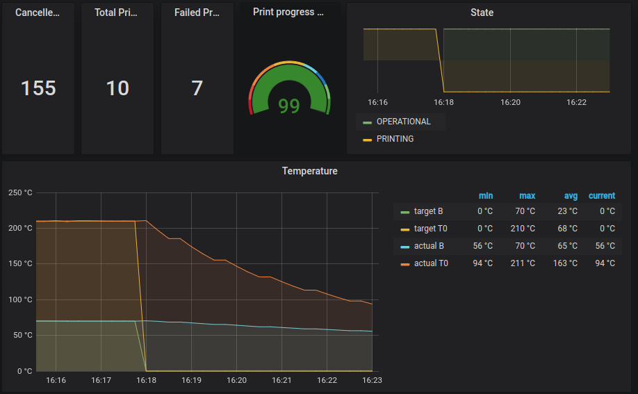

# Helpful Extras

Currently Cookiecutter generates the following helpful extras to this folder:

- [prometheus_exporter.md](./prometheus_exporter.md)
  Data file for plugins.octoprint.org. Fill in the missing TODOs once your
  plugin is ready for release and file a PR as described at
  http://plugins.octoprint.org/help/registering/ to get it published.

- `octoprint-grafana.json`
  Example configuration of Grafana dashboard

> This folder may be safely removed if you don't need it.
